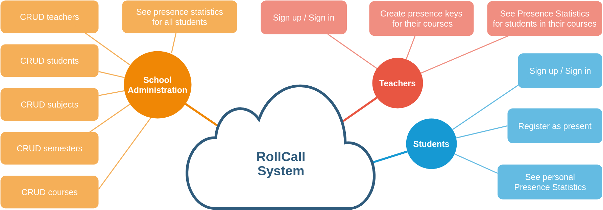
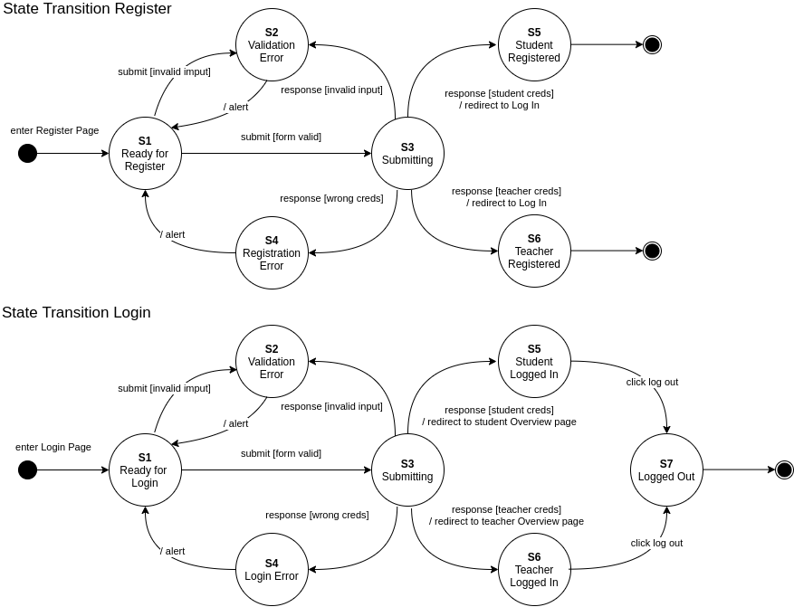
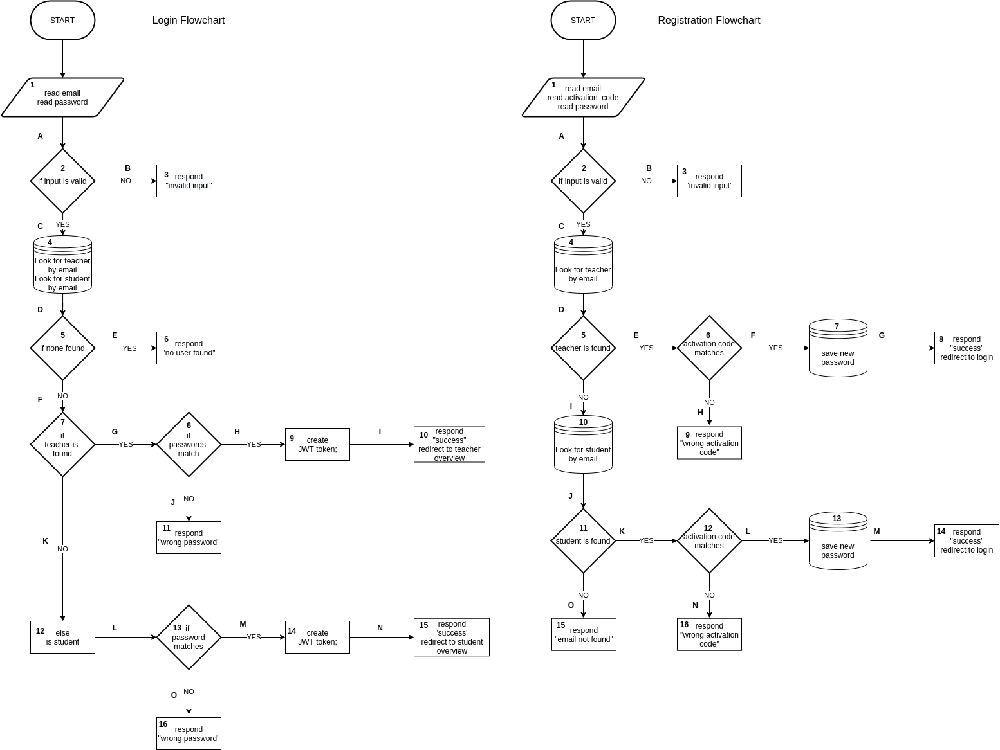

# Diagrams

Here we store relevant Diagrams that visualize parts of our systems or design goals and proposals.

You can edit the diagrams by clicking on the link, but keep in mind that the editor will open the version that is on the `documentation` branch. Any changes you make will be saved on that branch. Feel free to make changes and make a PR to `main` whenever you have a "Done" version.

## How to add a new diagram

1. Create a new .svg file with an appropriate title
2. Copy paste one of the below sections, replace the title in the link with the new title:

# System Schema for report

<a href="https://app.diagrams.net/#HstefanosAgelastos%2Fmulti-db-web-server%2Fdocumentation%2Fdocs%2Freport_system_schema.drawio.png" target="_blank">Edit in diagrams.net</a>

# Authorization State Transitions

<a href="https://app.diagrams.net/#HstefanosAgelastos%2Fmulti-db-web-server%2Fdocumentation%2Fdocs%2Fauth-states.drawio.png" target="_blank">Edit in diagrams.net</a>

# Authorization FlowChart

<a href="https://app.diagrams.net/#HstefanosAgelastos%2Fmulti-db-web-server%2Fdocumentation%2Fdocs%2Fauth-flowchart.drawio.png" target="_blank">Edit in diagrams.net</a>
